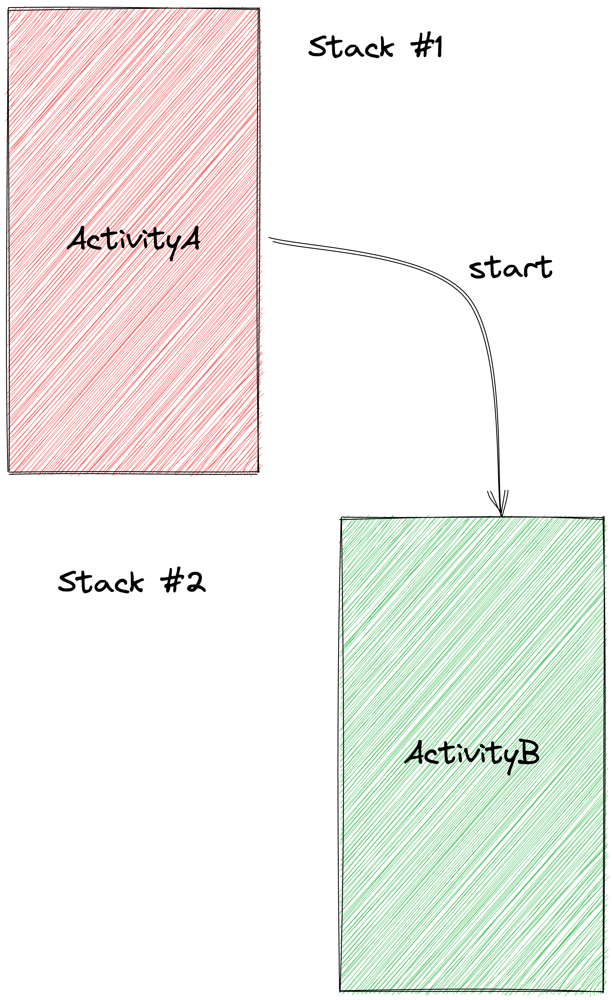

# Activity #3

### Задание #1
В классе **EditProfileActivity** по клику на `ImageView` с `id=imageview_photo` покажите Alert Dialog с выбором действия. Используйте реализацию диалога указанную в [примере](https://material.io/components/dialogs/android#simple-dialog), в качестве элементов массива добавьте элементы “Сделать фото” и “Выбрать фото”

По клику на кнопку Сделать фото запросите у пользователя Runtime Permission на использование камеры. Обработайте следующие возможные сценарии:

1. Пользователя выдал разрешение на использование камеры → отобразите в ImageView ресурс `R.drawable.cat`
2. Пользователь не разрешил использовать камеру первый раз → ничего не делаем
3. Пользователь еще раз запросил разрешение на использование камеры после отмены → покажите Rationale Dialog, и объясните зачем вам камера

   В качестве реализации Rationale Dialog используйте [простой Alert Dialog](https://material.io/components/dialogs/android#alert-dialog) с двумя кнопками: “Дать доступ” и “Отмена”. По клику на кнопку “Дать доступ” повторно запросите разрешение, по клику на кнопку “Отмена” закройте диалоговое окно

4. Пользователь повторно запретил использовать камеру → Покажите диалоговое окно с одной кнопкой → “Открыть настройки”. По клику на кнопку отправьте пользователя в настройки приложения, с возможностью поменять разрешение

> 💡 В этом задании вам не нужно использовать какое либо кеширование/флаги и прочее. Реализуйте все с использованием ResultApi и методов Activity

### Задание #2
По клику на кнопку “Выбрать фото” откройте экран выбора фото из галлереи, после того как вы получите URI фотографии в `ActivityResultCallback` вызовите метод `populateImage`, чтобы отобразить полученную фотографию в ImageView

> 💡 Используйте готовый контракт из класса `ActivityResultContracts` для открытия пикера медиафайлов

### Задание #3
1. Создайте класс-наследник Activity **FillFormActivity** и добавьте в нее 3 EditText для ввода имени, фамилии и возраста, и кнопку “Применить”
2. В **EditProfileActivity** по клику на кнопку “Редактировать профиль” откройте **FillFormActivity** с запросом результата, используя ResultApi
3. По нажатию на кнопку “Применить” на **FillFormActivity** заберите введенный текст из 3 полей и отправьте результат на запустившую ее Activity, тоесть на **EditProfileActivity**
4. В **EditProfileActivity** обработайте полученный результат и отобразите контент в соответствующих TextView
5. Реализуйте функцию `openSenderApp` так, чтобы она отправляла явный интент в Telegram, в качестве extras отправьте картинку полученную из галлереи и контент TextView

